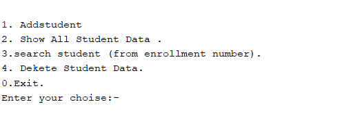
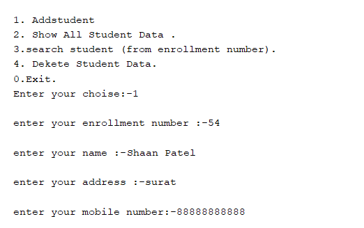
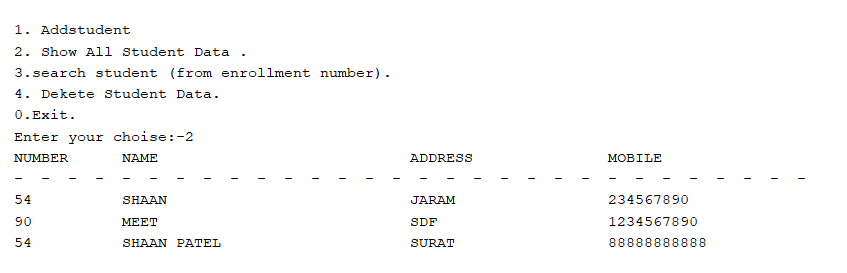

---

# 📚 Student Management System

A simple Java-based console application for managing student data. This project allows users to add, view, search, and delete student records stored in a text file.

## 📖 Overview
This program provides a command-line interface to perform CRUD (Create, Read, Update, Delete) operations on student records stored in `Student_data.txt`. Each student record includes:
- 📌 Enrollment Number
- 👤 Name
- 🏠 Address
- 📱 Mobile Number

## ✨ Features
- **Add Student**: Add new student information.
- **View All Students**: View all stored student data.
- **Search Student**: Find a student by enrollment number.
- **Delete Student**: Delete a student's record by enrollment number.

## 🗂️ File Structure
- **`StudentDBM`**: Contains methods for file operations.
  - **addStudent()**: Adds a student record.
  - **readerFile()**: Displays all student records.
  - **searchStudent()**: Searches for a student by enrollment number.
  - **DeleteLine()**: Deletes a student by enrollment number.
  - **replece()**: Renames the temporary file back to `Student_data.txt` after deletion.
- **`StudentManagment`**: Main class providing a menu-driven interface.

## 🚀 Getting Started

### Prerequisites
- Java Development Kit (JDK) 8 or higher.

### Installation and Usage
1. **Download the `StudentManagment.java` file only** from this repository.

   > **Note**: You do not need the other files to run this program.

2. Compile and run the program in a Java-compatible environment:
   ```bash
   javac StudentManagment.java
   java StudentManagment
   ```

   > **Important**: Avoid using VS Code to run this program, as file handling may not work consistently in VS Code due to its internal configuration. For best results, use the command line, IntelliJ IDEA,Netbean or Eclipse.

3. When prompted, choose an option from the menu:
    ```plaintext
     1. Add Student 
     2. Show All Student Data 
     3. Search Student (from enrollment number)
     4. Delete Student Data
     0. Exit
     Enter your choice:
    ```

4. Follow the prompts to add, view, search, or delete student records.

## 📸 Screenshots

### Main Menu


### Adding a Student


### Viewing All Students


> **Note**: You can add screenshots by capturing your console after each operation and saving them in a `screenshots` folder in your project.

## 📂 Data Storage
- All records are saved in `Student_data.txt`.
- Records are formatted with a `$` delimiter for easy parsing, e.g., `12345$Shaan Patel$123 Main St$5551234`.

## 📝 Example Outputs

### Adding a Student
```plaintext
enter your enrollment number: 12345
enter your name: Shaan Patel
enter your address: 123 Main St
enter your mobile number: 5551234
```

### Viewing All Students
```plaintext
NUMBER        NAME                           ADDRESS               MOBILE
------------------------------------------------------------------------
12345      Shaan Patel                     123 Main St             5551234
```

### Searching for a Student
```plaintext
enter en number: 12345
enrollment number     :- 12345
full name             :- Shaan Patel
address of student    :- 123 Main St
mobile number         :- 5551234
```

### Deleting a Student
```plaintext
enter en number of student that you want to delete: 12345
it is worked.
```

## ⚠️ Notes
- **File Handling**: A temporary file is used during deletion to ensure safe file operations.
- **Data Integrity**: Using a `$` delimiter allows for easy separation of data fields.

## 🛠️ Troubleshooting
- **File Not Found**: Ensure that `Student_data.txt` is in the same directory as the Java files, or it will be created on the first run.
- **File Permissions**: Ensure the file is writable for successful data modification.

## 🧑‍💻 Author
- Shaan Patel

---

> **Note**: If you have any unique ideas or need assistance, please don’t hesitate to reach out. I’m always open to collaboration and happy to help!

Happy coding!
